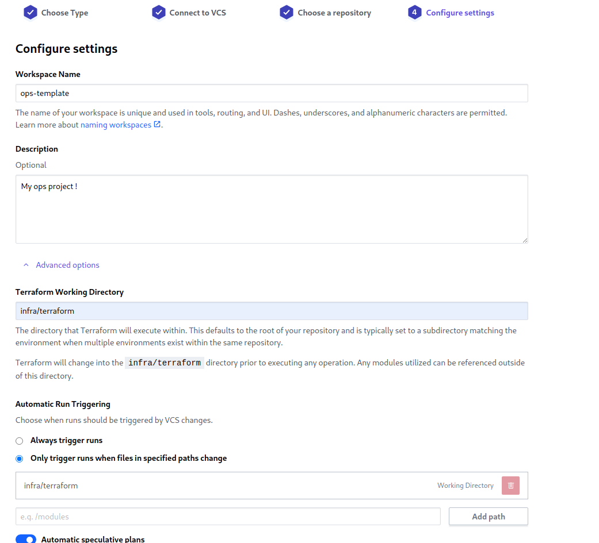
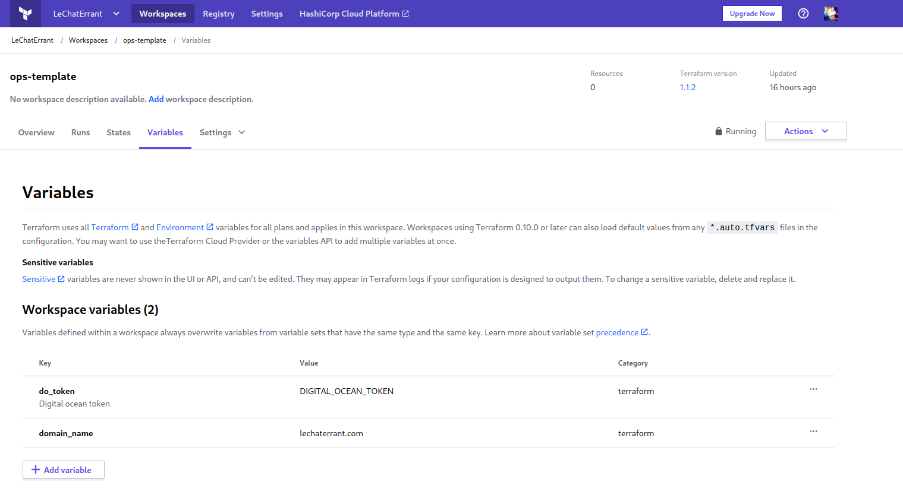

# Ops-template

# What is it ?

The purpose of this template is to provide a complete **production-ready** **kubernetes** infrastructure, focused on **automation**, **scalability**, and **monitoring**

It emphasizes on **reproducibility** by describing all the **infrastructure as code**, avoiding any **manual intervention** and reducing **human errors**

> This work is **still in progress** and is subject to many changes

<!-- START doctoc generated TOC please keep comment here to allow auto update -->
<!-- DON'T EDIT THIS SECTION, INSTEAD RE-RUN doctoc TO UPDATE -->
# Table of contents

- [Technologies](#technologies)
  - [Infrastructure](#infrastructure)
  - [Deployment](#deployment)
  - [Monitoring](#monitoring)
  - [Monitoring (alternative)](#monitoring-alternative)
- [Getting started](#getting-started)
  - [Digital Ocean](#digital-ocean)
  - [Terraform Cloud](#terraform-cloud)
  - [ArgoCD](#argocd)
- [Documentation](#documentation)
- [How to contribute](#how-to-contribute)
  - [Contributors](#contributors)

<!-- END doctoc generated TOC please keep comment here to allow auto update -->

# Technologies

## Infrastructure

- [Digital Ocean](https://www.digitalocean.com/) : Cloud provider
- [Terraform](https://www.terraform.io/) : Infrastructure as code
- [Terraform Cloud](https://www.terraform.io/cloud) : Terraform CD and remote state storage
- [Vault](https://www.vaultproject.io/) : Secret management
- [Kubernetes](https://kubernetes.io/) : Orchestrator
- [ArgoCD](https://argoproj.github.io/cd/) : K8S continuous deployment and cluster management
- [Traefik](https://traefik.io/) : Ingress controller and cloud networking

## Tools

- [Helm](https://helm.sh/) : Kubernetes objects templating
- [Kustomize](https://kustomize.io/) : K8S application customization
- [Ansible](https://www.ansible.com/) : Setup automation
- [Lens](https://k8slens.dev/) : K8S visualization

## Deployment

- [Cert manager](https://cert-manager.io/) : SSL certificates management
- [API template](https://github.com/LeChatErrant/API-template) : Backend
- [Front template](https://github.com/LeChatErrant/front-template) : Frontend
- [Redis](https://redis.io/) : Data caching
- [PostgreSQL](https://www.postgresql.org/) : Database

## Monitoring

- [Kibana](https://www.elastic.co/fr/kibana/) : Dashboard
- [Elasticsearch](https://www.elastic.co/fr/) : Search engine
- [Logstash](https://www.elastic.co/fr/logstash/) : Log aggregator and data processing
- [Filebeat](https://www.elastic.co/fr/beats/filebeat) : Log shipping
- [Metricbeat](https://www.elastic.co/fr/beats/metricbeat) : Metrics shipping
- [Packetbeat](https://www.elastic.co/fr/beats/packetbeat) : Network data shipping
- [Heartbeat](https://www.elastic.co/fr/beats/heartbeat) : Health check shipping
- [Prisma studio](https://www.prisma.io/studio) : Database visualisation
> and soon alerting !

## Monitoring (alternative)

- [Grafana](https://grafana.com/) : Dashboard
- [Loki](https://grafana.com/oss/loki/) : Logs aggregator
- [Prometheus](https://prometheus.io/) : Metrics aggregator
- [Alert manager](https://prometheus.io/docs/alerting/latest/alertmanager/) : Alerting

...and more

# Getting started

## Digital Ocean

Digital Ocean is used as **cloud provider**. Of course, you can use any other one, such as **GCP**, **Scaleway**, **AWS**, or even your own infrastructure.

1. Connect to Digital Ocean
2. Create a Personal Access Token with read and write scopes (https://www.digitalocean.com/docs/apis-clis/api/create-personal-access-token/)

## Terraform Cloud

**Terraform** is a tool enabling you to describe your **infrastructure as code** in the form of HashiCorp Configuration Language, or HCL (*.tf files)

With it, you don't need to do manual actions on a cloud provider dashboard, reducing **human errors** and making your infrastructure **reproductible**

**Terraform cloud** will hold your terraform **state** in the cloud, allowing multiple developers to work on it at the same time and using your repository as the unique **source of truth** for the infrastructure
- Developers can still `terraform plan` when they are working, to see their change against the current infra
- When merging on master, terraform cloud will calculate your new plan. Simple apply it in the UI when you want to update the infrastructure

1. Connect to [Terraform Cloud](https://www.terraform.io/cloud)

2. Once connected, create a workspace pointing to your ops git repository

3. Add terraform variables to your workspace (including your Digital Ocean access token)

4. Add your organization and your workspace into the [terraform/cloud.tf](https://github.com/LeChatErrant/ops-template/blob/master/infra/terraform/cloud.tf) to use terraform cloud as remote backend

5. Start a new plan on terraform cloud UI

6. Apply it and take a coffee

**Congratulation**, you just deployed a whole infrastructure on Digital Ocean, including
 - Digital ocean root project
 - K8S autoscaled cluster
 - Load balancer
 - Domain
 - DNS records for subdomains :
   - traefik.example.com
   - argocd.example.com
   - kibana.example.com
   - studio.example.com
   - api.example.com

## ArgoCD

We will use **ArgoCD** to **synchronize** the cluster state with our repository and to **manage** our K8S apps

The only thing we deploy by hand is argoCD, which will then deploy every apps present in the repository

> Coming soon, work still in progress
> 
> Soon, the only thing to deploy on the cluster will be ArgoCD, which will manage all the other apps and deploy them directly from the repository

# Documentation

> Coming soon

# How to contribute

1. Fork it (**<https://github.com/LeChatErrant/ops-template/fork>**)
2. Create your feature branch (`git checkout -b my-new-feature`)
3. Commit your changes (`git commit -am 'Add some feature'`)
4. Push to the branch (`git push origin my-new-feature`)
5. Create a new Pull Request

Issues and comments welcomed ! :wink:

## Contributors

 &nbsp; **[LeChatErrant](https://github.com/LeChatErrant)** - creator and maintainer
